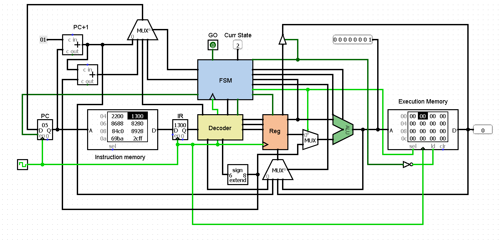
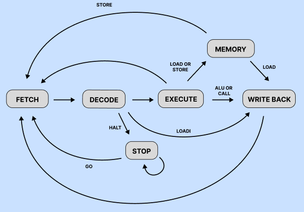

# 🖥️ CPU 8 bits — Simulation Logisim

> Un processeur 8 bits conçu et simulé de zéro sous Logisim, inspiré de la philosophie MIPS — pensé pour être simple, pédagogique, et à terme construit physiquement.

---

## 📖 Présentation

Ce projet est la conception et la simulation complète d'un processeur 8 bits custom sous [Logisim Evolution](https://github.com/logisim-evolution/logisim-evolution). L'objectif est de comprendre chaque couche de l'architecture d'un processeur — des portes logiques jusqu'à l'exécution d'algorithmes — avant de passer à une implémentation sur FPGA, puis à une construction purement matérielle.

Le processeur est volontairement simple pour rester accessible pédagogiquement et réalisable en hardware.

---


*Architecutre globale de la CPU*

---

## ✨ Caractéristiques

| Caractéristique | Détail |
|---|---|
| **Architecture** | Harvard (mémoire d'instruction séparée de la mémoire de travail) |
| **Largeur de données** | 8 bits |
| **Largeur d'instruction** | 16 bits (taille fixe) |
| **ROM** | 512 octets — 256 instructions |
| **RAM** | 256 octets |
| **Registres** | 8 registres de travail (R0–R7) + 3 spéciaux (PC, IR, SR) |
| **Modèle d'exécution** | Multicycle : Fetch → Decode → Execute → Memory → Writeback |
| **Unité de contrôle** | FSM (Machine à états finis) |
| **Opérations ALU** | 8 opérations + flags (Negative, Zero, Overflow, Carry) |
| **Taille du jeu d'instructions** | 16 instructions |

---

## 🗂️ Structure du dépôt

```
cpu-logisim/
├── cpu.circ                 # Fichier principal du circuit Logisim
├── programs/                # Programmes exemples en assembleur
│   └── *.asm
├── docs/
│   └── Spécifications.docx  # Document de spécification complet
└── README.md
```

---

## 🧠 Architecture

### Registres

Le processeur dispose de **11 registres** au total.

#### Registres spéciaux (gérés par le pipeline, non accessibles en écriture par les instructions)

| Registre | Taille | Rôle |
|---|---|---|
| `PC` | 8 bits | Program Counter — adresse de l'instruction courante |
| `IR` | 16 bits | Instruction Register — contient l'instruction en cours |
| `SR` | 3 bits | State Register — état courant de la FSM |

#### Registres de travail

| Code | Registre | Notes |
|---|---|---|
| `000` | R0 | **Registre de référence** — contient `0x00` par convention. À ne pas écraser sauf nécessité absolue. |
| `001` | R1 | Usage général |
| `010` | R2 | Usage général |
| `011` | R3 | Usage général |
| `100` | R4 | Usage général |
| `101` | R5 | Usage général |
| `110` | R6 | Usage général |
| `111` | R7 | **Registre de lien** — sauvegardé par `CALL`. À ne pas écraser dans une subroutine. |

> ⚠️ **R0** est le registre zéro de référence. L'écraser tout en comptant sur sa valeur nulle produira des résultats incorrects.
>
> ⚠️ **R7** est le registre de lien utilisé par `CALL`/`RET`. L'écraser à l'intérieur d'une subroutine corrompra l'adresse de retour et entraînera un comportement imprévisible.

---

## 📜 Jeu d'instructions (ISA)

Les instructions sont **sur 16 bits à taille fixe**. Les **4 bits de poids fort** encodent l'opcode ; les **12 bits restants** encodent les opérandes.

```
[ 15 : 12 ]  [ 11 : 0 ]
  opcode       opérandes
```

Types d'opérandes :
- **Registre** — 3 bits (encode R0–R7)
- **Immédiat** — 8 bits
- **Offset** — 6 bits
- **Padding** — bits non utilisés, notés `X` (don't care)

### Table des opcodes

| Opcode | Mnémonique | Format | Description |
|---|---|---|---|
| `0000` | `LOAD` | `Rd Rs Offset` | Charge depuis la mémoire à l'adresse `Rs + Offset` dans `Rd` |
| `0001` | `STORE` | `Rd Rs Offset` | Stocke `Rd` en mémoire à l'adresse `Rs + Offset` |
| `0010` | `LOADI` | `Rd X Valeur` | Charge la valeur immédiate 8 bits dans `Rd` |
| `0011` | `JMP` | `X X Adresse` | Saut inconditionnel vers `Adresse` |
| `0100` | `CALL` | `X X Adresse` | Sauvegarde `PC+1` dans R7, puis saut vers `Adresse` |
| `0101` | `RET` | `X X X` | Saut vers l'adresse contenue dans R7 (retour de subroutine) |
| `0110` | `BLT` | `Rt Rs Offset` | Branchement si `Rt < Rs` |
| `0111` | `BEQ` | `Rt Rs Offset` | Branchement si `Rt == Rs` |
| `1000` | `ADD` | `Rd Rs Rt` | `Rd = Rs + Rt` |
| `1001` | `SUB` | `Rd Rs Rt` | `Rd = Rs - Rt` |
| `1010` | `NOT` | `Rd Rs X` | `Rd = ~Rs` (NOT bit à bit) |
| `1011` | `OR` | `Rd Rs Rt` | `Rd = Rs \| Rt` |
| `1100` | `AND` | `Rd Rs Rt` | `Rd = Rs & Rt` |
| `1101` | `XOR` | `Rd Rs Rt` | `Rd = Rs ^ Rt` |
| `1110` | `SHIFT` | `Rd Rs Rt` | Décalage logique de `Rs` par `Rt`, résultat dans `Rd` |
| `1111` | `HALT` | `X X X` | Stoppe le CPU (état STOP jusqu'au signal `GO`) |

### Exemple d'encodage

```
ADD  R5, R4, R3

1000  101  100  011  XXX
│     │    │    │    └── padding (don't care)
│     │    │    └─────── Rt = R3 (011)
│     │    └──────────── Rs = R4 (100)
│     └───────────────── Rd = R5 (101)
└─────────────────────── opcode ADD (1000)

→ 0b 1000_1011_0001_1XXX
```

---

## ⚙️ Machine à états finis (FSM)

L'unité de contrôle est pilotée par une FSM à 6 états :



---

| État | Rôle |
|---|---|
| **Fetch** | Chargement de l'instruction depuis la ROM vers IR |
| **Decode** | Décodage de l'instruction et préparation des signaux de contrôle |
| **Execute** | Exécution de l'opération ALU ou calcul de la cible de branchement |
| **Memory** | Lecture ou écriture en RAM (uniquement pour LOAD/STORE) |
| **Writeback** | Écriture du résultat dans le registre de destination |
| **Stop** | CPU en pause — attend le signal externe `GO` pour reprendre |

---

## 🔧 Assembleur

Un assembleur en C++ est fourni pour convertir un fichier source `.txt` en instructions binaires et hexadécimales, directement chargeables dans la ROM de Logisim.

### Compilation

```bash
cd assembler
g++ -o assembler main.cpp
```

### Utilisation

1. Écrire le programme dans un fichier texte (par exemple `instructions_fibbomo.txt`, déjà rempli)
2. Dans `main.cpp`, modifier le nom du fichier source en ligne 67 :
   ```cpp
   std::ifstream f("mon_programme.txt");
   ```
3. Compiler et exécuter :
   ```bash
   g++ -o assembler main.cpp
   ./assembler
   ```
4. L'assembleur affiche pour chaque instruction son encodage **binaire** puis **hexadécimal**.
5. Copier les valeurs hexadécimales dans la mémoire d'instructions ROM de Logisim (clic droit → *Edit Contents*).

### Syntaxe

Chaque ligne contient une instruction et ses opérandes séparés par des espaces.
Les valeurs immédiates et les offsets sont en **hexadécimal** préfixé par `0x`.
Les commentaires commencent par `*` et sont ignorés jusqu'à la fin de la ligne.

```
LOADI R1 0x05       * charge 5 dans R1
LOADI R2 0x03       * charge 3 dans R2
ADD   R3 R1 R2      * R3 = R1 + R2
STORE R3 R0 0x00    * stocke R3 en mémoire à l'adresse 0
HALT
```

## 🚀 Prise en main

### Prérequis

- [Logisim](https://sourceforge.net/projects/circuit/)
- [Compilateur G++](https://sourceforge.net/projects/mingw/)
### Lancer la simulation

1. Cloner le dépôt :
   ```bash
   git clone https://github.com/votre-username/cpu-logisim.git
   cd cpu-logisim
   ```

2. Ouvrir `cpu.circ` dans Logisim Evolution.

3. Charger un programme dans le composant ROM (clic droit → *Edit Contents*) en utilisant l'encodage binaire défini par l'ISA ci-dessus.

4. Lancer la simulation de l'horloge et observer le CPU exécuter les instructions cycle par cycle.

---

## 🗺️ Feuille de route

- [x] Conception de l'ISA
- [x] Simulation Logisim
- [x] Assembleur C++ (hexadécimal) (⚠️Assembleur pour le moment assez fragile)
- [ ] Implémentation FPGA (VHDL/Verilog) 
- [ ] Construction matérielle physique

---

